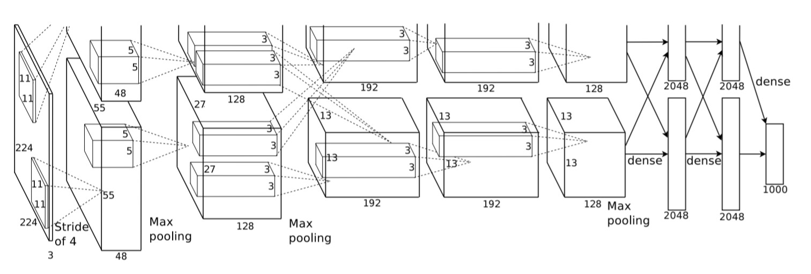
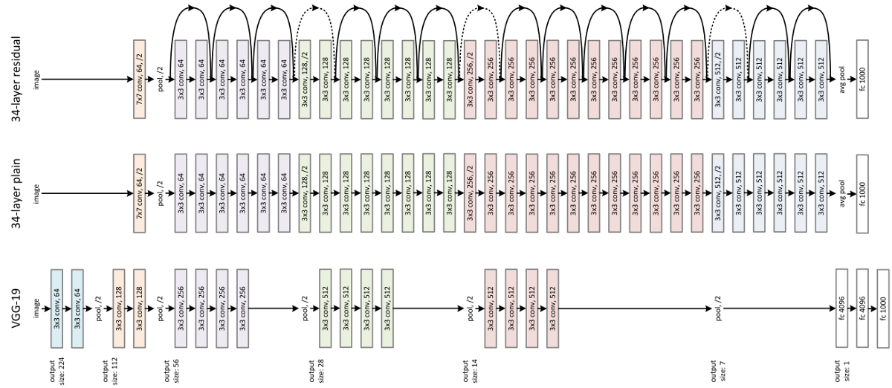
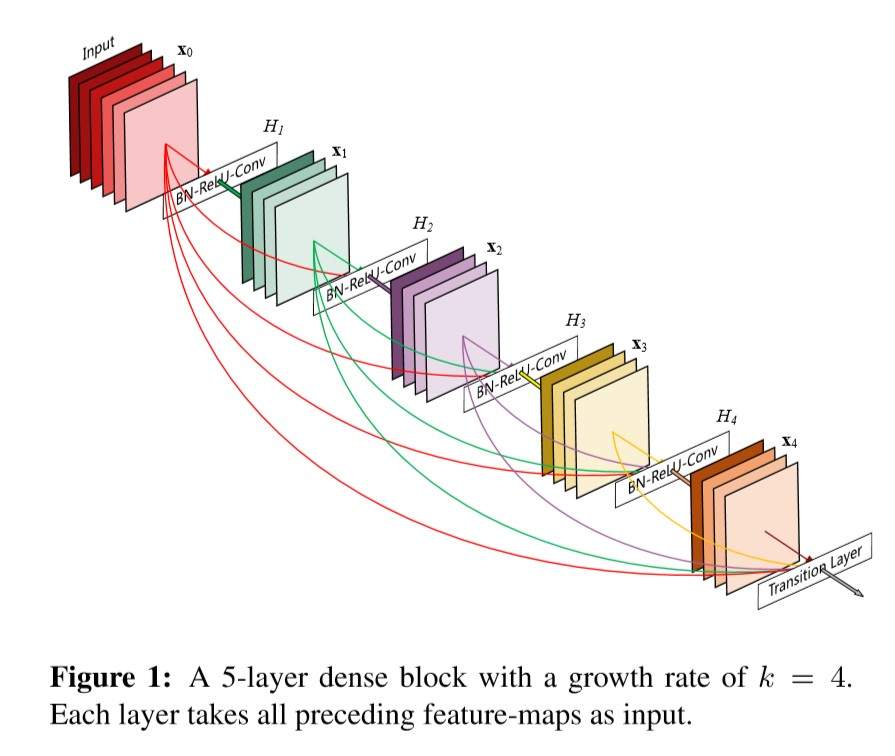

## vision-tutorial

`vision-tutorial` is a tutorial for who is studying `Computer Vision Basic Architectures` using **Pytorch** and **Keras**. Most of the models about Vision were implemented with less than **100 lines** of code(except comments or blank lines). The list of these papers is a list that Professor [Sung Kim](https://github.com/hunkim) recommended.

- Data was used as overfitting to show simple model learning. [One image about Cat or Dog](https://github.com/graykode/vision-tutorial/tree/master/data)

- The accuracy of the model is not important in this project because it is affected by data. I recommend that you **focus on the structure of the model, the number of parameters, the learning process and paper detailed implementation. **

  

## SOTA Basic Vision Models - Introduction

- How to handle image in Pytorch and Keras

  - Image Resizing, Cropping

- Introduction CNN(Convolutional Neural Networks) in Pytorch and Keras

  - How does number of channels, filter size (=kernel), grid, and padding affect Convolution?

  - Paper : [Object Recognition with Gradient-Based Learning](http://yann.lecun.com/exdb/publis/pdf/lecun-99.pdf)

- AlexNet(2012.09)

  - Paper : [ImageNet Classification with Deep Convolutional Neural Networks](https://papers.nips.cc/paper/4824-imagenet-classification-with-deep-convolutional-neural-networks.pdf)

  - Model

    

- ZFNet(2013.11)

  - Paper : [Visualizing and Understanding Convolutional Networks](https://arxiv.org/abs/1311.2901)

- VGG16(2014.09)

  - Paper : [Very Deep Convolutional Networks for Large-Scale Image Recognition](https://arxiv.org/abs/1409.1556)

- Inception.v1(a.k.a GoogLeNet)(2014.09)

  - Paper : [Going Deeper with Convolutions](https://arxiv.org/abs/1409.4842)

- Inception.v2, v3(2015.12)

  - Paper : [Rethinking the Inception Architecture for Computer Vision](https://arxiv.org/abs/1512.00567)

- ResNet(2015.12)

  - Paper : [Deep Residual Learning for Image Recognition](https://arxiv.org/abs/1512.03385)
  - Model
    

- Inception.v4(2016.02)

  - Paper : [Inception-v4, Inception-ResNet and the Impact of Residual Connections on Learning](https://arxiv.org/abs/1602.07261)

- DenseNet(2016.08)

  - Paper : [Densely Connected Convolutional Networks](https://arxiv.org/abs/1608.06993)
  - Model
    

- Xception(2016.10)

  - Paper : [Xception: Deep Learning with Depthwise Separable Convolutions](https://arxiv.org/abs/1610.02357)

- MobileNet(2017.04)

  - Paper : [MobileNets: Efficient Convolutional Neural Networks for Mobile Vision Applications](https://arxiv.org/abs/1704.04861)

- SENet(2017.09)

  - Paper : [Squeeze-and-Excitation Networks](https://arxiv.org/abs/1709.01507)

## To be Continue Implementation in Other Repository

#### v Semantic Segmentation

- FCN(2014.11) : [Fully Convolutional Networks for Semantic Segmentation](https://arxiv.org/abs/1411.4038)
- U-Net(2015.05) : [U-Net: Convolutional Networks for Biomedical Image Segmentation](https://arxiv.org/abs/1505.04597)](https://arxiv.org/abs/1606.00915)
- SegNet(2015.11) : [SegNet: A Deep Convolutional Encoder-Decoder Architecture for Image Segmentation](https://arxiv.org/abs/1511.00561)
- DeepLab(2016.06) : [DeepLab: Semantic Image Segmentation with Deep Convolutional Nets, Atrous Convolution, and Fully Connected CRFs](https://arxiv.org/abs/1606.00915)
- ENet(2016.07) : [ENet: A Deep Neural Network Architecture for Real-Time Semantic Segmentation](https://arxiv.org/abs/1606.02147)
- PSPNet(2016.12) : [Pyramid Scene Parsing Network](https://arxiv.org/abs/1612.01105)
- ICNet(2017.04) : [ICNet for Real-Time Semantic Segmentation on High-Resolution Images](https://arxiv.org/abs/1704.08545)

#### v Generative adversarial networks

- GAN(2014.06) : [Generative Adversarial Networks](https://arxiv.org/abs/1406.2661)
- DCGAN(2015.11) : [Unsupervised Representation Learning with Deep Convolutional Generative Adversarial Networks](https://arxiv.org/abs/1511.06434)
- Pix2Pix(2016.11) : [Image-to-Image Translation with Conditional Adversarial Networks](https://arxiv.org/abs/1611.07004)
- WGAN(2017.01) : [Wasserstein GAN](https://arxiv.org/abs/1701.07875)
- CycleGAN(2017.05) : [Unpaired Image-to-Image Translation using Cycle-Consistent Adversarial Networks](https://arxiv.org/abs/1703.10593)

#### v Object Detection

- RCNN(2013.11) : [Rich feature hierarchies for accurate object detection and semantic segmentation](https://arxiv.org/abs/1311.2524)
- Fast-RCNN(2015.04) : [Fast R-CNN](https://arxiv.org/abs/1504.08083)
- Faster-RCNN(2015.06) : [Faster R-CNN: Towards Real-Time Object Detection with Region Proposal Networks](https://arxiv.org/abs/1506.01497)
- YOLO(2015.06) : [You Only Look Once: Unified, Real-Time Object Detection](https://arxiv.org/abs/1506.02640)
- SSD(2015.12) : [SSD: Single Shot MultiBox Detector](https://arxiv.org/abs/1512.02325)
- YOLO9000(2016.12) : [YOLO9000: Better, Faster, Stronger](https://arxiv.org/abs/1612.08242)
- Mask R-CNN(2017.05) : [Mask R-CNN](https://arxiv.org/abs/1703.06870)
- RetinaNet(2017.08):  [Focal Loss for Dense Object Detection](https://arxiv.org/abs/1708.02002)

## Author

- Tae Hwan Jung(Jeff Jung) @graykode
- Author Email : [nlkey2022@gmail.com](mailto:nlkey2022@gmail.com)